# Advanced Features

Explore CronoPay's advanced capabilities for power users and developers.

## Transaction Simulator

Test transactions without spending real tokens.

### Basic Simulation

```
"Simulate sending 5 USDC to 0x742d35Cc6634C0532925a3b844Bc9e7595f0bEb"
```

**Response:**
```json
{
  "wouldSucceed": true,
  "gasEstimate": "65000",
  "gasCost": "1300000000000000",
  "balanceChanges": {
    "from": {
      "before": "15.5 devUSDC.e",
      "after": "10.5 devUSDC.e"
    },
    "to": {
      "before": "0 devUSDC.e",
      "after": "5 devUSDC.e"
    }
  },
  "riskLevel": "medium",
  "warnings": ["Transferring >30% of balance"]
}
```

### Large Amount Simulation

```
"Simulate sending 100 USDC to 0x742d35... and show what would happen"
```

CronoPay will flag:
- Insufficient balance errors
- High risk warnings
- Gas estimation failures

### Use Cases

1. **Testing Payment Flows**: Verify logic before production
2. **Gas Budgeting**: Estimate costs for batch operations
3. **Risk Assessment**: Identify potential issues early
4. **User Education**: Show users what will happen

## Batch Transfers

Send to multiple recipients in one operation.

### Basic Batch

```
"Send 1 USDC to these 3 addresses: 0x742d35..., 0xE20D41..., 0x123..."
```

**Benefits:**
- Single command for multiple transfers
- Optimized nonce management
- Sequential execution
- Individual transaction hashes

### Airdrop Pattern

```
"Send 0.5 USDC to 10 addresses: [paste address list]"
```

Perfect for:
- Token airdrops
- Team payments
- Reward distributions

### Estimate Batch Gas

Before executing, estimate total cost:

```
"Estimate gas for sending 1 USDC to 5 different addresses"
```

**Response:**
```json
{
  "totalGas": "325000",
  "totalCost": "6500000000000000",
  "perTransfer": "65000",
  "recipients": 5
}
```

## Transaction Analytics

Query and analyze your transaction history.

### Recent Transactions

```
"Show me all my transactions from the last 7 days"
```

**Response:**
```json
{
  "totalTransactions": 15,
  "totalSent": "45000000",
  "totalReceived": "10000000",
  "mostFrequentRecipient": {
    "address": "0x742d35...",
    "count": 5
  },
  "transactions": [...]
}
```

### Spending Summary

```
"What's my total spending this week?"
```

**Response:**
```json
{
  "totalSpent": "45 USDC",
  "transactionCount": 15,
  "averagePerDay": "6.4 USDC",
  "message": "In the last 7 days: 15 transactions, 45 USDC spent"
}
```

### Analytics Queries

```
"Who did I send the most tokens to?"
"Show transfers over 10 USDC in the last month"
"What's my average transaction amount?"
```

## Smart Contract Tools

Interact with smart contracts via natural language.

### Contract Inspection

```
"Inspect contract at 0xc01efAaF7C5C61bEbFAeb358E1161b537b8bC0e0"
```

**Response:**
```json
{
  "address": "0xc01ef...",
  "name": "devUSDC.e (devUSDC.e)",
  "functions": [
    "name",
    "symbol",
    "decimals",
    "totalSupply",
    "balanceOf",
    "transfer"
  ],
  "events": ["Transfer", "Approval"]
}
```

### Read Contract Functions

```
"Read balanceOf on 0xc01ef... for 0x742d35..."
```

Query contract state without gas costs.

### Gas Estimation

```
"Estimate gas for sending 10 USDC to 0x123..."
```

**Response:**
```json
{
  "gasEstimate": "65000",
  "gasCost": "1300000000000000",
  "message": "Estimated gas: 65000 units, Cost: 0.0013 CRO"
}
```

### Transaction Decoder

```
"Decode transaction 0xabc123..."
```

**Response:**
```json
{
  "from": "0xSender",
  "to": "0xRecipient",
  "value": "5000000",
  "gasUsed": "65000",
  "blockNumber": 12345,
  "status": "success",
  "explorerUrl": "https://explorer.cronos.org/testnet/tx/0xabc123..."
}
```

## Visual Planning

Generate execution flow diagrams.

### HTML Visualization

```
"Visualize in HTML: Send 5 USDC if balance > 10"
```

Creates an interactive HTML page with:
- Beautiful timeline view
- Risk badges (color-coded)
- Conditional logic visualization
- AI reasoning explanations

### Mermaid Diagram

```
"Visualize in Mermaid: Send 2 USDC to Alice"
```

Generates flowchart code for documentation:

```mermaid
graph TD
    Start([User Intent]) --> Plan
    Plan[📋 Plan: 1 step]
    Plan --> Step1[💸 Transfer 2 USDC]
    Step1 --> End([✅ Complete])
```



### ASCII Flow

```
"Visualize in ASCII: Batch send to 3 addresses"
```

Terminal-friendly text visualization for CLI tools.

## Combining Features

### Simulate + Visualize + Execute

```
1. "Simulate sending 10 USDC if balance > 20"
2. "Visualize in HTML: Send 10 USDC if balance > 20"
3. "Send 10 USDC if balance > 20"
```

Complete workflow:
1. Test without risk
2. See visual flow
3. Execute with confidence

### Batch + Analytics

```
1. "Send 1 USDC to 5 addresses: [...]"
2. "Show me all my transactions from today"
```

Execute batch operation, then analyze results.

### Inspect + Estimate + Transfer

```
1. "Inspect contract at 0xc01ef..."
2. "Estimate gas for sending 5 USDC"
3. "Send 5 USDC to 0x742d35..."
```

Full developer workflow in natural language.

## Next Steps

- [Visual Planning](../features/visual-planning)
