# Visual Planning

See your execution flow before running it.

## Overview

CronoPay's visual planning feature generates beautiful diagrams that show:
- Step-by-step execution flow
- Conditional logic paths
- Risk assessment for each step
- AI reasoning and explanations

## Output Formats

### HTML (Interactive)

**Best for**: Presentations, stakeholder reviews, documentation

```
"Visualize in HTML: Send 5 USDC if balance > 10"
```

**Features:**
- 🎨 Beautiful gradient design
- 📊 Timeline view with step indicators
- 🎯 Color-coded risk badges
- 🔒 Conditional logic visualization
- 💡 AI reasoning explanations
- 📱 Responsive (mobile + desktop)
- 🖨️ Print-ready format

**Output Location**: `/visualizations/plan-[timestamp].html`

### Mermaid (Documentation)

**Best for**: GitHub README, GitLab docs, Notion, Obsidian

```
"Visualize in Mermaid: Send 2 USDC to Alice"
```

**Features:**
- Flowchart format
- Decision trees
- Color-coded nodes
- GitHub-compatible
- Easy to modify

**Example Output:**


```mermaid
graph TD
    Start([User Intent]) --> Plan
    Plan[📋 Plan: 2 steps]
    Plan --> Step1[💰 Check Balance]
    Step1 --> Cond1{Balance > 10?}
    Cond1 -->|Yes| Step2[💸 Transfer 5 USDC]
    Cond1 -->|No| Skip[⏭️ Skip]
    Step2 --> End([✅ Complete])
    Skip --> End
    
    classDef riskLow fill:#51cf66
    classDef riskMedium fill:#ffd93d
    class Step1 riskLow
    class Step2 riskMedium
```

### ASCII (Terminal)

**Best for**: CLI tools, logs, terminal output

```
"Visualize in ASCII: Transfer 2 USDC to Bob"
```

**Features:**
- Terminal-friendly
- Unicode box-drawing
- Emoji indicators
- Compact format
- Copy-paste ready

**Example Output:**
```
╔═══════════════════════════════════════╗
║         EXECUTION FLOW                ║
╚═══════════════════════════════════════╝

    📝 User Intent
         ↓
    📋 Plan (2 steps, MEDIUM risk)
         ↓
    💰 Check Balance 🟢
         ↓
    💸 Transfer 2 USDC 🟡
         ├─ 🔍 Conditions
         │  └─ balance >= 2
         ├─ ✓ Pass → Execute
         └─ ✗ Fail → Skip
         ↓
    ✅ Complete
```

## Use Cases

### 1. Developer Debugging

**Problem**: Complex payment flow not working

**Solution**: Visualize to see execution path

```
"Visualize in HTML: Send 10 USDC if balance > 20 and CRO > $0.10"
```

See exactly where conditions fail or succeed.

### 2. Stakeholder Presentations

**Problem**: Explaining payment logic to non-technical team

**Solution**: Generate HTML visualization

```
"Visualize in HTML: Batch send 1 USDC to 5 team members if budget > 100"
```

Share interactive HTML for review.

### 3. Documentation

**Problem**: Need to document payment workflows

**Solution**: Use Mermaid diagrams

```
"Visualize in Mermaid: Conditional payment with market check"
```

Embed in README or docs.

### 4. Audit Trails

**Problem**: Need to show compliance officers the logic

**Solution**: HTML with full explanations

```
"Visualize in HTML: Multi-step payment with risk assessment"
```

Includes AI reasoning and risk analysis.

## Visual Elements

### Risk Badges

- 🟢 **LOW**: Small amounts, simple logic
- 🟡 **MEDIUM**: Moderate amounts, some conditions
- 🔴 **HIGH**: Large amounts, complex conditions
- 🚨 **CRITICAL**: Very large amounts, high risk

### Step Icons

- 💰 Balance check
- 💸 Token transfer
- 🔍 Condition evaluation
- 📋 Plan generation
- ⚠️ Risk assessment
- 🛑 Cancel/Stop

### Conditional Paths

```
Condition Check
    ├─ ✓ Pass → Continue
    └─ ✗ Fail → Skip
```

## Best Practices

### 1. Visualize Complex Logic

Always visualize before executing complex plans:

```
"Visualize in HTML: Send 5 USDC if balance > 10 and CRO > $0.10 and volatility < 5%"
```

### 2. Share for Review

Generate HTML for team review:

```
1. "Visualize in HTML: [complex plan]"
2. Share HTML file with team
3. Get approval
4. Execute plan
```

### 3. Document Workflows

Use Mermaid for permanent documentation:

```
1. "Visualize in Mermaid: Standard payment flow"
2. Add to README.md
3. Version control the diagram
```

### 4. Debug with ASCII

Quick terminal debugging:

```
"Visualize in ASCII: [failing plan]"
```

See the flow without leaving terminal.

## Examples

### Simple Transfer

```
"Visualize in HTML: Send 2 USDC to 0x742d35..."
```

Shows:
- Single step execution
- Risk: LOW
- No conditions

### Conditional Transfer

```
"Visualize in HTML: Send 5 USDC if balance > 10"
```

Shows:
- Balance check step
- Conditional branch
- Transfer step
- Risk: MEDIUM

### Market-Aware Transfer

```
"Visualize in HTML: Send 1 USDC if CRO > $0.10"
```

Shows:
- Market data query
- Price condition check
- Transfer step
- Risk: MEDIUM

### Batch Transfer

```
"Visualize in HTML: Send 1 USDC to 5 addresses"
```

Shows:
- Multiple transfer steps
- Sequential execution
- Total amount calculation
- Risk: MEDIUM-HIGH

## Next Steps

- [Try Examples](../examples/advanced-features)
