# MCP Tools Overview

CronoPay provides 16 MCP tools across 4 categories.

## Finance Tools

### transferToken

Send USDC tokens on Cronos Testnet.

**Parameters:**
- `to` (string): Recipient wallet address
- `amount` (string): Amount of USDC to transfer

**Example:**
```
"Send 5 USDC to 0x742d35Cc6634C0532925a3b844Bc9e7595f0bEb"
```

**Response:**
```json
{
  "success": true,
  "txHash": "0x123...",
  "from": "0xYourAddress",
  "to": "0x742d35...",
  "amount": "5",
  "status": "pending",
  "explorerUrl": "https://explorer.cronos.org/testnet/tx/0x123..."
}
```

### getBalance

Check ERC20 token balance for a wallet address.

**Parameters:**
- `tokenAddress` (string): Token contract address
- `walletAddress` (string): Wallet address to check

**Example:**
```
"Check my USDC balance"
```

### cancel_pending_transaction

Cancel a pending transaction by sending a 0-value transaction with higher gas.

**Parameters:**
- `nonce` (number, optional): Specific nonce to cancel

**Example:**
```
"Cancel my pending transaction"
```

## AI Planning Tools

### create_execution_plan

Generate a multi-step execution plan with risk assessment.

**Parameters:**
- `intent` (string): Natural language payment intent

**Example:**
```
"Create a plan to send 5 USDC if balance > 10"
```

**Response:**
```json
{
  "success": true,
  "plan": {
    "intent": "Send 5 USDC if balance > 10",
    "steps": [
      {
        "action": "Check wallet balance",
        "toolName": "check_wallet_balance",
        "riskLevel": "low"
      },
      {
        "action": "Transfer 5 USDC",
        "toolName": "transferToken",
        "riskLevel": "medium",
        "conditions": [
          {
            "type": "balance",
            "operator": ">",
            "value": "10"
          }
        ]
      }
    ],
    "overallRiskLevel": "medium"
  },
  "explanation": {
    "whyThisPlan": "...",
    "riskAssessment": "...",
    "alternatives": [...]
  }
}
```

### check_wallet_balance

Check wallet balance with detailed information.

### assess_transaction_risk

Assess risk level for a proposed transaction.

## DevTools

### visualize_plan

Generate visual representation of an execution plan.

**Parameters:**
- `intent` (string): Payment intent to visualize
- `format` (enum): Output format - `html`, `mermaid`, or `ascii`

**Example:**
```
"Visualize in HTML: Send 5 USDC if balance > 10"
```

**Formats:**

**HTML**: Interactive visualization with timeline, risk badges, and explanations

**Mermaid**: Flowchart diagram for documentation

```mermaid
graph TD
    Start([User Intent]) --> Plan
    Plan[📋 Plan: 2 steps]
    Plan --> Step1[💰 Check Balance]
    Step1 --> Cond1{Conditions Met?}
    Cond1 -->|Yes| Step2[💸 Transfer 5 USDC]
    Cond1 -->|No| Skip[⏭️ Skip]
    Step2 --> End([✅ Complete])
```


**ASCII**: Terminal-friendly text visualization

### inspect_contract

Inspect a smart contract on Cronos Testnet.

**Parameters:**
- `address` (string): Contract address

**Example:**
```
"Inspect contract at 0xc01efAaF7C5C61bEbFAeb358E1161b537b8bC0e0"
```

### read_contract

Call a read-only function on a smart contract.

**Parameters:**
- `address` (string): Contract address
- `functionName` (string): Function name to call
- `args` (array, optional): Function arguments

**Example:**
```
"Read balanceOf on 0xc01ef... for 0x742d35..."
```

### estimate_gas

Estimate gas cost for a contract function call.

### decode_transaction

Decode and analyze a transaction by its hash.

**Parameters:**
- `txHash` (string): Transaction hash

**Example:**
```
"Decode transaction 0xabc123..."
```

## Advanced Tools

### simulate_transfer

Simulate a token transfer without executing it (dry run).

**Parameters:**
- `tokenAddress` (string): Token contract address
- `to` (string): Recipient address
- `amount` (string): Amount to transfer

**Example:**
```
"Simulate sending 100 USDC to 0x742d35... and show what would happen"
```

**Response:**
```json
{
  "success": true,
  "wouldSucceed": true,
  "gasEstimate": "65000",
  "gasCost": "1300000000000000",
  "balanceChanges": {
    "from": {
      "before": "150000000 devUSDC.e",
      "after": "50000000 devUSDC.e"
    },
    "to": {
      "before": "0 devUSDC.e",
      "after": "100000000 devUSDC.e"
    }
  },
  "riskLevel": "high",
  "warnings": ["Transferring >50% of balance"]
}
```

### batch_transfer

Send tokens to multiple recipients in one operation.

**Parameters:**
- `tokenAddress` (string): Token contract address
- `recipients` (array): Array of recipient addresses
- `amounts` (array): Array of amounts (must match recipients length)

**Example:**
```
"Send 1 USDC to these 3 addresses: 0x742d35..., 0xE20D41..., 0x123..."
```

### estimate_batch_gas

Estimate total gas cost for a batch transfer.

### query_transactions

Query and analyze transaction history for an address.

**Parameters:**
- `address` (string): Wallet address to query
- `minAmount` (string, optional): Minimum transaction amount filter
- `days` (number, optional): Number of days to look back (default: 7)
- `limit` (number, optional): Maximum number of transactions (default: 50)

**Example:**
```
"Show me all my transactions from the last 7 days"
```

### get_spending_summary

Get a summary of spending for an address over a time period.

**Parameters:**
- `address` (string): Wallet address
- `days` (number, optional): Number of days (default: 7)

**Example:**
```
"What's my total spending this week?"
```

## Tool Categories Summary

| Category | Tools | Use Case |
|----------|-------|----------|
| **Finance** | 3 tools | Basic token operations |
| **AI Planning** | 3 tools | Intelligent execution planning |
| **DevTools** | 5 tools | Developer productivity |
| **Advanced** | 5 tools | Simulation, batch, analytics |

**Total**: 16 MCP tools

## Next Steps

- [Try Example Prompts](../examples/basic-payments)
- [Learn About Visual Planning](../features/visual-planning)
- [Explore Advanced Features](../examples/advanced-features)
